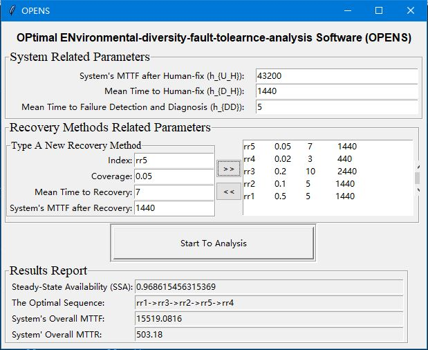

# OPENS

OPENS stands for OPtimal ENvironmental-diversity-based-fault-tolerance-analysis Software.

## The Aim of OPENS

The primary purpose of developing OPENS is for calculating the system's steady-state availability and determing the optimal sequence to arrange a set of recovery methods.

## The Usage of OPENS

Let us check a snapshot of OPENS.

There are three steps of applying OPENS.

* Step 1. Configure the **System-Related-Parameters**.
In this step, a user should provide the values of  the system's mean time faiure (MTTF) after human-fix, mean time to human-fix, and mean time to failure detection and diagnosis.

* Step 2. Configure the **Recovery-Methods-Related-Parameters**. 
* * To add a recovery method, a tester is required to provide four values, that are the index, the coverage, the mean time to recovery, and the system's MTTF after applying this recovery method.
* * After this, a tester should click the ">>" button to add the recovery method to a recovery-method-sequence.
* * If a tester would like to correct or remove a recovery method from the recovery-method-sequence to the left, he/she just need to click the recovery method to select the one and push the "<<" to remove it to the stage area to the right. After this, he/she can re-edit the recover method or just let it be.

* Step 3. Click the "Start To Analysis" button. After this, the system's optimal steady-state availability (SSA), the optimal recovery sequence for five given recovery methods, the system's overall mean time to recovery (MTTR), and the system's overall mean time to failure (MTTF) will be reported in the "Results Report" region.

## Related Paper: